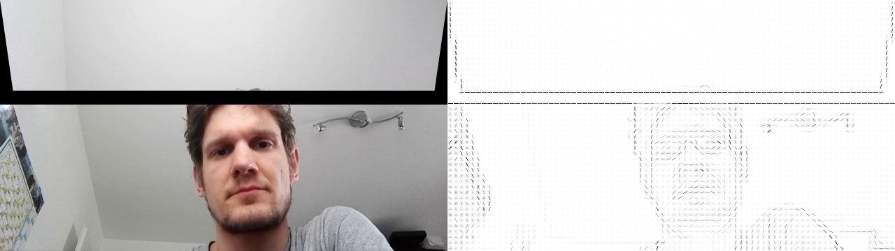
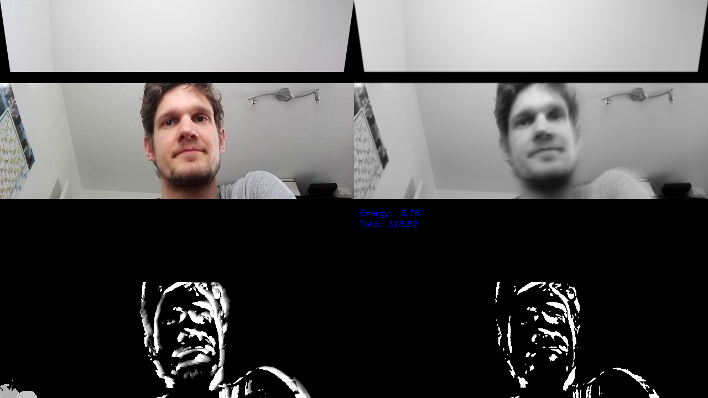
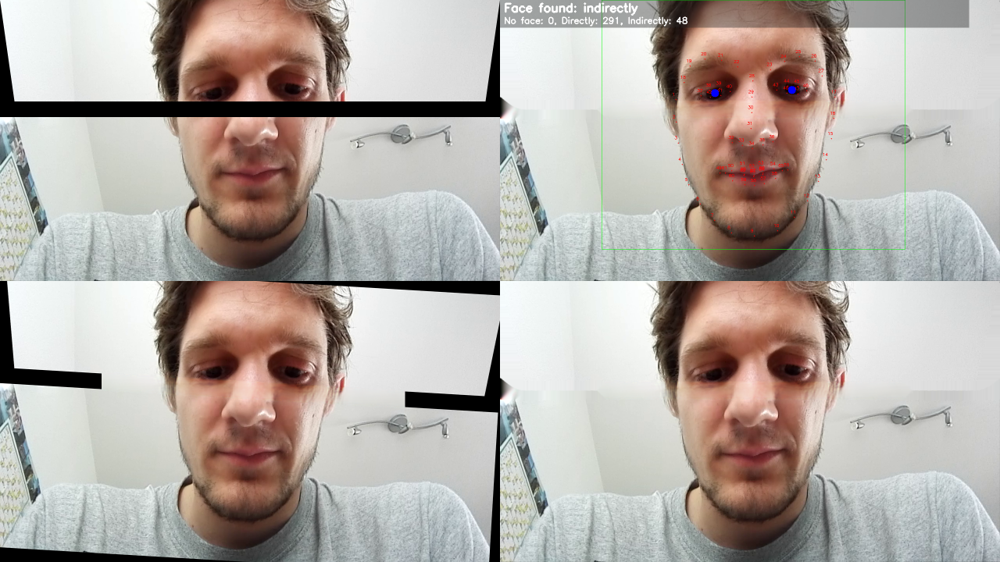

# Video-Pipeline for face restoration

For my master-thesis I implemented a pipeline-framework to easy apply various steps to multiple videos. The idea was to have the logic split up in classes (steps) which can be applied consecutively and independently.
To supervise the results, a live-composition can be shown which shows the result of different steps simultaneously.

## Frameworks

Please see in the requirements.txt the needed libraries. In short: it mainly builds on OpenCV, whereas the facial restoration (inpainting) is done with a neuronal network (Keras and TensorFlow).
The current implementation uses the specified versions of Keras and TensorFlow, otherwise it won't work.

## Models

For the facial restoration, two pre-trained models are used.

* For face detection with dlib, the known 68-face-landmark.dat is used.
    * Download: http://data.breitmuuufrosch.ch/models/opencv/shape_predictor_68_face_landmarks.dat
* For face restoration/inpainting, a pre-trained .h5 is used. The model included in this repository is trained as followed:
    * Download: http://data.breitmuuufrosch.ch/models/pconv_keras/70_celeba_hq.h5
    * Used data: CelebA-HQ (http://mmlab.ie.cuhk.edu.hk/projects/CelebA.html)
        * Train: 25'000 images
        * Test: 2'500 images
        * Validate: 2'5000 images
    * Implementation: https://github.com/MathiasGruber/PConv-Keras (16.01.2019)
        * Only lines with different thickness and steepness are used for masking.
        * Input: 512x512 RGB image
        * Input-mask: 512x512 black-white-image
        * Output: 512x512 RGB image with mask inpainted
        
# Examples/Usage

## Code

### Hog features

```python
# Needed imports
from video.pipeline import Composition2x1, Saver, SimpleController, OpenCvPipeline, Scaling
from video.opencv import HogExtractor


# We apply three steps.
# 1. We scale the video to have half the height and half the width
# to faster process
step_scaling = Scaling(0.5)

# 2. We extract the Hog-Features
step_hog = HogExtractor(orientations=9, pixels_per_cell=8)

# 3. We save the result of the step_hog into the given file.
step_save = Saver("path_to_restored.mp4")


# To visualize the process, we want to render the result from the
# scale-step and the visual result from the hog-features.
composition = Composition2x1(
    width=640, height=360,
    left=step_scaling.get_result,
    right=step_hog.get_result,
    is_horizontal=True
)

# Define the steps as array (order is important!)
steps = [step_scaling, step_hog, step_save]
# The simple controller allows to quit the process with "q"
controller = [SimpleController()]

# Create the pipeline and initialize it with the input.
cv_pipeline = OpenCvPipeline(steps, controller, composition, True)
# For a file, specify the "path_to_input_file.mp4"
# For a webcam, specify the number of the webcam (usually 0)
cv_pipeline.init("path_to_input_file.mp4", "path_to_save_composition.mp4")

# Apply the steps for the specified frames.
# cv_pipeline.apply(start_frame=1000, num_frames=250)
cv_pipeline.apply(start_frame=0)
```



### Fidgeting index

```python
# Needed imports
from video.pipeline import Composition2x2, Saver, SimpleController, OpenCvPipeline, Scaling
from video.fidgeting import MovementExtractor


# We apply three steps.
# 1. We scale the video to have half the height and half the width
# to faster process
step_scaling = Scaling(0.5)

# 2. We extract the Hog-Features
step_fidgeting = MovementExtractor(
    use_gray_scale=True,
    difference_threshold=30,
    adaption=0.1,
    use_mhi=False,
    mhi_decay=20,
    gaussian_size=3,
    csv_path="path_to_file_with_value_per_frame.csv"
)

# 3. We save the result of the step_hog into the given file.
step_save = Saver("path_to_extracted.mp4")


# To visualize the process, we want to render the result from the
# scale-step and the visual result from the hog-features.
composition = Composition2x2(
    640, 360,
    step_scaling.get_result,
    step_fidgeting.get_background,
    step_fidgeting.get_mhi,
    step_fidgeting.get_result_printed
)

# Define the steps as array (order is important!)
steps = [step_scaling, step_fidgeting, step_save]
# The simple controller allows to quit the process with "q"
controller = [SimpleController()]

# Create the pipeline and initialize it with the input.
cv_pipeline = OpenCvPipeline(steps, controller, composition, True)
# For a file, specify the "path_to_input_file.mp4"
# For a webcam, specify the number of the webcam (usually 0)
cv_pipeline.init("path_to_input_file.mp4", "path_to_save_composition.mp4")

# Apply the steps for the specified frames.
# cv_pipeline.apply(start_frame=1000, num_frames=250)
cv_pipeline.apply(start_frame=0)
```



### Face restoration

(Please see [here](https://breitmuuufrosch.ch/de/portfolio-items/master-thesis-emotion-predictor-machine-learning-based-prediction-of-emotions-using-facial-features/) for more information.)

```python
# Needed imports
from video.pipeline import Composition2x2, Saver, SimpleController, OpenCvPipeline, Scaling
from video.inpainting_tf import FaceInpaintingPConvKeras


# We apply three steps.
# 1. We scale the video to have half the height and half the width
# to faster process
step_scaling = Scaling(0.5)

# 2. We extract the Hog-Features
parameters = {
    "mirror_center_x": 582, "mirror_center_y": -1761,  "mirror_radius": 2191,
    "padding": 40, "warp_top": 0, "warp_bottom": 60
}
step_face_restoration = FaceInpaintingPConvKeras(
    model_path="path_to_inpainting_model.h5",
    dat_face_predictor="path_to_face_predictor.dat",
    fix_parameters=parameters,
    always_inpaint=False,
    use_naive_inpaint_for_two_step=False
)

# 3. We save the result of the step_hog into the given file.
step_save = Saver("path_to_extracted.mp4")


# To visualize the process, we want to render the result from the
# scale-step and the visual result from the hog-features.
composition = Composition2x2(
    640, 360,
    step_face_restoration.get_input,
    step_face_restoration.get_result_printed,
    step_face_restoration.get_aligned,
    step_face_restoration.get_result
)

# Define the steps as array (order is important!)
steps = [step_scaling, step_face_restoration, step_save]
# The simple controller allows to quit the process with "q"
controller = [SimpleController()]

# Create the pipeline and initialize it with the input.
cv_pipeline = OpenCvPipeline(steps, controller, composition, True)
# For a file, specify the "path_to_input_file.mp4"
# For a webcam, specify the number of the webcam (usually 0)
cv_pipeline.init("path_to_input_file.mp4", "path_to_save_composition.mp4")

# Apply the steps for the specified frames.
# cv_pipeline.apply(start_frame=1000, num_frames=250)
cv_pipeline.apply(start_frame=0)
```


## Implemented steps

### General steps

```python
import video.pipeline.steps
```

* **Saver**: Save the result from the previous steps. This can be used in the middle to save different steps in different videos.
* **Viewer**: View the result from the previous steps. This can be used in the middle to view different steps in different videos.
* **Scaling**: Scale the input with the desired ratio. The pipeline will take care correctly for the reduced size for latter steps.

### OpenCV steps

```python
import video.opencv
```

* **HistogramEqualizer**: Equalize the histogram
* **GammaAdjustment**: Gamma adjustment
* **HogExtractor**: Extract the hog-features and visually show them
* **SimpleInPainter**: Inpaint the given mask with the OpenCV implementation

### Fidgeting steps

```python
import video.fidgeting
```

* **MovementExtractor**: Extract the movement based on the paper "Predicting Movie Ratings from Audience Behaviors" and "The Representation and Recognition of Action
Using Temporal Templates". Basically, the amount of different pixels over the region of interest is analyzed.

### Mirror steps

```python
import video.mirror
```

These steps are thesis-specific, where we had to restore the face on the front-camera-stream. To capture the complete face, a mirror was attached, which resulted in two different regions in the complete video source. As a result, some parts of the face were occluded/invisible.
(Please see [here](https://breitmuuufrosch.ch/de/portfolio-items/master-thesis-emotion-predictor-machine-learning-based-prediction-of-emotions-using-facial-features/) for more information.)

* **SwitchMirrorNormal**: Arrange the two regions to have a normal view on the face.
* **MirrorInPainter**: Inpaint the occluded parts from the different regions with the basic inpainter form OpenCV.


### Inpainting/restoration steps

```python
import video.inpainting_tf
```

These steps are thesis-specific, where we had to restore the face on the front-camera-stream. To capture the complete face, a mirror was attached, which resulted in two different regions in the complete video source. As a result, some parts of the face were occluded/invisible.
(Please see [here](https://breitmuuufrosch.ch/de/portfolio-items/master-thesis-emotion-predictor-machine-learning-based-prediction-of-emotions-using-facial-features/) for more information.)

* **FaceInpaintingPConvKeras**: Consists of two steps internally:
    * First, detect the face. If no face is found, try to inpaint naively with the last known position and try to detect the face again. (Significantly higher chance to succeed)
    * Inpaint the face based on the detected landmarks.
